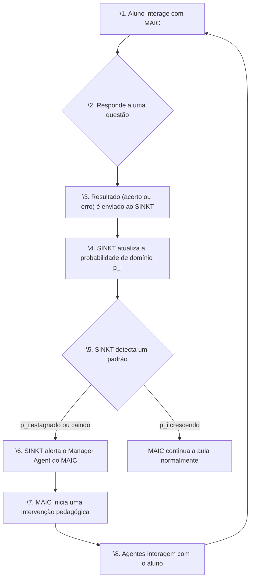

# Resumo Técnico Comparativo: MAIC & SINKT

**Data:** 16 de novembro de 2025  

---

## 1. Introdução

Este documento apresenta uma análise técnica comparativa entre os modelos **MAIC (Massive AI-empowered Course)** e **SINKT (Structure-Aware Inductive Knowledge Tracing)**. Embora ambos utilizem tecnologias de ponta como LLMs para aprimorar a educação online, seus focos, abordagens e aplicações são fundamentalmente diferentes, porém altamente complementares.

## 2. Visão Geral dos Modelos

### SINKT: O Diagnóstico Preditivo

O SINKT é um modelo de **rastreamento de conhecimento (Knowledge Tracing)**. Seu principal objetivo é **diagnosticar e prever** o estado de conhecimento de um aluno.

> **Analogia:** O SINKT é como um **exame de sangue contínuo** para o aprendizado. Ele não ensina, mas mede constantemente o nível de domínio do aluno sobre cada conceito, permitindo prever seu desempenho futuro.

### MAIC: A Experiência de Ensino Interativa

O MAIC é um modelo de **entrega de conteúdo e interação pedagógica**. Seu principal objetivo é **ensinar e engajar** o aluno em uma experiência de aprendizado rica e adaptativa.

> **Analogia:** O MAIC é como uma **equipe de professores e colegas particulares** que usam os resultados do exame de sangue (SINKT) para criar uma aula personalizada, oferecer ajuda e manter o aluno motivado.

## 3. Tabela Comparativa

| Característica | SINKT (Structure-Aware Inductive Knowledge Tracing) | MAIC (Massive AI-empowered Course) |
| :--- | :--- | :--- |
| **Função Principal** | Diagnóstico e Predição | Instrução e Interação |
| **Objetivo Primário** | Medir e prever o domínio do aluno (pᵢ) | Ensinar conteúdo e engajar o aluno |
| **O que responde?** | "O aluno sabe este conceito? Ele acertará a próxima questão?" | "Qual é a melhor forma de ensinar este conceito e ajudar o aluno agora?" |
| **Abordagem** | Modelagem matemática e estatística (Grafos, LLMs, BKT) | Sistema multi-agentes com personalidades distintas (LLMs) |
| **Principal Saída** | Uma probabilidade (pᵢ) de domínio por aluno/conceito | Uma aula interativa e diálogos pedagógicos |
| **Papel do LLM** | Entender a semântica de questões e conceitos para criar grafos | Gerar scripts de aula, diálogos e personalidades dos agentes |
| **Interação com Aluno** | Passiva (analisa o histórico de respostas) | Ativa (conversa com o aluno em tempo real) |
| **Unidade de Análise** | A interação (acerto/erro) do aluno | A sessão de aprendizado como um todo |
| **Caso de Uso** | - Identificar lacunas de conhecimento - Personalizar trilhas de aprendizado - Prever desempenho em avaliações | - Criar cursos de forma rápida e barata - Oferecer suporte emocional e motivacional - Simular um ambiente de sala de aula |

## 4. Análise da Complementaridade: Como SINKT e MAIC se Conectam

SINKT e MAIC não são concorrentes; eles são duas metades de um sistema de tutoria inteligente ideal. A integração entre eles cria um ciclo de feedback poderoso que potencializa a personalização do ensino.

### O Ciclo de Feedback SINKT ↔ MAIC

### Detalhes da Integração

1.  **SINKT como o "Cérebro Analítico":** O SINKT funciona nos bastidores, recebendo cada interação do aluno dentro do ambiente MAIC. Ele processa esses dados para manter um perfil de conhecimento detalhado e atualizado (o valor de pᵢ para cada conceito).

2.  **MAIC como o "Braço Pedagógico":** O MAIC utiliza o perfil de conhecimento fornecido pelo SINKT para tomar decisões pedagógicas em tempo real.

### Exemplos Práticos da Integração

-   **Detecção de Dificuldade:** Se o SINKT reporta que a probabilidade de domínio (pᵢ) de um aluno em "loops" está estagnada em 0.3 (como no cenário simulado), o MAIC pode:
    -   Ativar o **Agente Tutor** para fazer perguntas mais aprofundadas.
    -   Ativar o **Agente Conselho** para sugerir uma nova estratégia de estudo.
    -   Ativar o **Agente Amigo** para oferecer encorajamento e reduzir a frustração.

-   **Adaptação de Conteúdo:** Se o SINKT indica que um aluno já tem um domínio de 0.9 em um conceito pré-requisito, o MAIC pode:
    -   Instruir o **Teacher Agent** a pular a revisão básica e ir direto para os tópicos avançados, economizando o tempo do aluno.

-   **Formação de Grupos:** O MAIC pode usar os dados do SINKT para criar grupos de estudo simulados, juntando um aluno com alta proficiência em um conceito (identificado pelo SINKT) com outro que está com dificuldades, promovendo a aprendizagem entre pares (peer learning).

## 5. Conclusão

Em resumo, a distinção fundamental é:

-   **SINKT é um modelo de *medição* do aprendizado.** Ele quantifica o conhecimento.
-   **MAIC é um modelo de *ação* sobre o aprendizado.** Ele entrega a instrução e a intervenção.

A combinação de ambos permite a criação de um sistema educacional verdadeiramente adaptativo, que não apenas entende o que o aluno sabe, mas também sabe como agir com base nesse entendimento para maximizar o aprendizado, o engajamento e o bem-estar do aluno.
