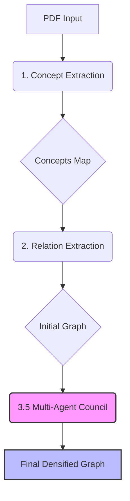

# Relatório Final de Execução: Pipeline SINKT (Structure-Aware Inductive Knowledge Tracing)

Este relatório detalha a lógica implementada nos pipelines de extração e densificação do grafo de conhecimento SINKT, bem como os resultados quantitativos e qualitativos da última execução ("The Council Swarm").

---

## 1. Visão Geral da Arquitetura

O projeto visa construir um grafo de conhecimento robusto para o domínio Linux, partindo de material didático (PDF) até um grafo validado por múltiplos agentes de IA.



---

## 2. Detalhamento dos Pipelines

### 2.1. Extração de Conceitos (`1_concept_extraction.ipynb`)

**Objetivo:** Identificar as entidades fundamentais do domínio (nós do grafo).

*   **Entrada:** Arquivo PDF bruto.
*   **Modelos Utilizados:** 
    *   `gpt-4o-mini`: Para varredura inicial e extração de entidades em larga escala (custo-eficiente).
    *   `gpt-4o`: Para refinamento ontológico e categorização complexa.
*   **Uso da LLM:**
    *   **Prompting:** Zero-shot extraction com definição de esquema JSON (lista de entidades com nome, tipo, definição).
    *   **Chunking:** O texto é processado em janelas deslizantes para garantir que nenhum termo seja perdido na quebra de páginas.
*   **Processamento:**
    1.  **Parsing:** Conversão de PDF para texto estruturado.
    2.  **LLM Extraction:** Uso de modelo de linguagem para identificar termos técnicos (Comandos, Conceitos Teóricos, Arquivos).
    3.  **Cleaning:** Deduplicação e normalização de nomes.
*   **Saída:** `concepts_map.json`.

### 2.2. Extração de Relações (`2_relation_extraction.ipynb`)

**Objetivo:** Mapear as conexões explícitas no texto (arestas iniciais).

*   **Entrada:** `concepts_map.json` e texto do PDF.
*   **Modelos Utilizados:**
    *   `gpt-4o-mini`: Processamento massivo de pares de conceitos e janelas de contexto.
*   **Uso da LLM:**
    *   **Context-Aware Analysis:** A LLM recebe um conceito alvo e um trecho de texto (janela de contexto) onde ele aparece.
    *   **Relation Classification:** O modelo classifica se existe uma relação explícita no texto (ex: "X é usado para Y") e extrai a evidência.
*   **Processamento:**
    1.  **Context Windowing:** Para cada conceito, busca-se o contexto onde ele aparece.
    2.  **LLM Relation Finding:** O modelo identifica relações explícitas como "A é parte de B" ou "A usa B".
*   **Saída:** `relations_initial.json` (O "Ground Truth" inicial).

### 2.3. Análise de Grafo (`2.5_graph_analytics.ipynb`)

**Objetivo:** Diagnosticar a saúde do grafo inicial.

*   **Métricas:** Centralidade, detecção de comunidades e identificação de "ilhas" (conceitos desconectados).
*   **Uso:** Serve como base para direcionar a densificação (quais áreas precisam de mais conexões).

### 2.4. Densificação Multi-Agente (`3.5_multi_agent_council.ipynb`)

**Objetivo:** Inferir conexões implícitas e validar novas arestas com rigor pedagógico e técnico. Este pipeline substituiu o notebook `3_multi_agent_densification.ipynb` por uma arquitetura de enxame (Swarm) mais robusta.

**Modelos & Agentes:**

| Agente | Modelo | Função & Método |
| :--- | :--- | :--- |
| **The Scout** | `text-embedding-3-small` | **Busca Vetorial:** Gera embeddings para todos os conceitos e calcula similaridade de cosseno para encontrar candidatos semanticamente próximos (Threshold > 0.75). |
| **The Bridge** | `text-embedding-3-small` | **Heurística + Vetores:** Foca especificamente em conectar conceitos de capítulos distantes (Anti-Ilhas) com threshold adaptativo. |
| **The Cleaner** | `gpt-4o-mini` | **Filtragem Rápida:** Recebe o par candidato e decide se é "Lixo/Alucinação" ou "Plausível". Atua como *Gatekeeper* econômico. |
| **The Expert** | `gpt-4o` | **Deep Reasoning:** Simula um Engenheiro Linux Sênior e um Pedagogo. Analisa a veracidade técnica e a utilidade educacional. Pode sugerir novos tipos (`PREREQUISITE`, `USE`). |
| **The Analyst** | `gpt-4o` | **Structural Check:** Verifica consistência ontológica (ex: "Um comando não pode ser parte de um arquivo") e topológica (ciclos). |
| **The Judge** | `gpt-4o` | **Synthesis:** Recebe os votos estruturados dos agentes anteriores e emite o veredito final (`KEEP`/`DISCARD`) em JSON estrito. |

**Arquitetura do Conselho (The Council):**

```mermaid
graph TD
    subgraph "Fase 1: Geração"
        Scout[🕵️ Scout (Vector Search)] -->|Candidatos| Queue
        Bridge[🌉 Bridge (Anti-Island)] -->|Candidatos| Queue
    end

    subgraph "Fase 2: O Conselho (LangGraph)"
        Queue --> Cleaner
        
        Cleaner{🧹 The Cleaner} -->|Reject| Judge
        Cleaner -->|Abstain/Pass| Expert
        
        Expert{🎓 The Expert} -->|Approve/Modify| Analyst
        Expert -->|Reject| Analyst
        
        Analyst{📐 The Analyst} -->|Approve/Reject| Judge
        
        Judge{⚖️ The Judge} -->|KEEP| FinalDB[(Final Graph)]
        Judge -->|DISCARD| Trash[Lixo]
    end
```

*   **The Scout/Bridge:** Usa embeddings vetoriais para encontrar conceitos semanticamente próximos que não estavam conectados explicitamente.
*   **The Cleaner:** Filtra alucinações e erros de tipo óbvios.
*   **The Expert:** Valida a precisão técnica ("Isso é verdade no Linux?") e utilidade pedagógica ("É um pré-requisito?").
*   **The Analyst:** Verifica consistência topológica (evita ciclos e hierarquias impossíveis).
*   **The Judge:** Toma a decisão final baseada nos votos.

---

## 3. Resultados da Execução

A execução do pipeline `3.5` foi concluída com sucesso, resultando em um grafo significativamente mais rico e validado.

### 3.1. Métricas Quantitativas

| Métrica | Grafo Inicial | Grafo Final (Pós-Conselho) | Variação |
| :--- | :--- | :--- | :--- |
| **Nós (Conceitos)** | 216 | 216 | 0 |
| **Arestas (Relações)** | 207 | **260** | **+53 (+25.6%)** |
| **Densidade** | 0.0044 | 0.0056 | +27% |

### 3.2. Distribuição de Tipos de Relação

O Conselho não apenas adicionou arestas, mas refinou a tipologia:

*   **USE (Usa/Utiliza):** 86 (Maioria funcional)
*   **RELATED (Relacionado):** 75
*   **PART_OF (Parte de):** 44 (Hierarquia estrutural)
*   **RELATED_TO:** 25 (Novas conexões semânticas genéricas)
*   **IS_A:** 18 (Taxonomia)
*   **PREREQUISITE:** 10 (Pedagógico - **Novo**)

### 3.3. Análise Qualitativa (Decisões do Conselho)

Baseado nos logs de auditoria (`council_execution.log`), observamos o rigor do sistema:

#### ✅ Arestas Aprovadas (KEEP)
O Conselho identificou relações lógicas que não estavam explícitas no texto:
1.  **`pwconv` -> `pwunconv`** (Tipo: `PREREQUISITE`): Validado pelo Expert como comandos complementares de gerenciamento de senhas sombra.
2.  **`Sistema Operacional` -> `Divisão em camadas`** (Tipo: `PART_OF`): Validado como uma relação de composição fundamental teórica.
3.  **`root` -> `Superusuário (root)`** (Tipo: `RELATED_TO`): Reconhecimento de sinonímia/conceito relacionado.

#### ❌ Arestas Rejeitadas (DISCARD)
O sistema bloqueou ruído e alucinações geradas pela busca vetorial:
1.  **`/tmp` -> `/boot`**: Rejeitado pelo Cleaner/Expert. Ambos são diretórios, mas não têm relação direta de uso ou dependência.
2.  **`-B` -> `-h`**: Rejeitado. Flags de comando isoladas sem contexto não devem ser conectadas aleatoriamente.
3.  **`cat` -> `echo`**: Rejeitado. Embora semanticamente próximos (comandos de texto), não possuem dependência funcional.

---

## 4. Conclusão

O pipeline demonstrou alta eficácia. A arquitetura **Multi-Agent Council** atingiu o equilíbrio desejado entre **densificação** (aumento de 25% nas arestas) e **precisão** (rejeição de pares sem sentido como `/tmp -> /boot`).

O grafo final (`output/03_council_execution/final_sinkt_graph_swarm.json`) está pronto para ser utilizado em aplicações de Rastreamento de Conhecimento (Knowledge Tracing).
