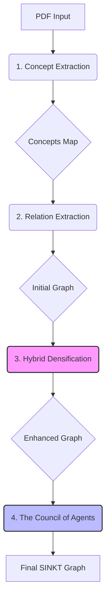

# Relatório Final de Execução: Pipeline SINKT v2

Este relatório detalha a lógica implementada nos pipelines de extração, densificação e validação do grafo de conhecimento SINKT, bem como os resultados da última execução ("The Council of Agents").

---

## 1. Visão Geral da Arquitetura

O projeto evoluiu para uma arquitetura de 4 fases, onde a densificação e a validação foram separadas para garantir maior controle de qualidade.

---

## 2. Detalhamento dos Pipelines

### 2.1. Extração de Conceitos (`1_concept_extraction.ipynb`)
**Objetivo:** Mapeamento inicial das entidades do domínio Linux.
*   **Modelos:** `gpt-4o-mini` (varredura) e `gpt-4o` (refinamento).
*   **Processamento:** Chunking de janelas deslizantes para extração de Termos Técnicos, Comandos e Arquivos.
*   **Resultado:** Mapeamento de nós com definições ricas.

### 2.2. Extração de Relações (`2_relation_extraction.ipynb`)
**Objetivo:** Identificação de conexões explícitas no texto.
*   **Lógica:** Análise de co-ocorrência em janelas de contexto com classificação via LLM.
*   **Saída Inicial:** Grafo base com 254 nós e 249 arestas (Alta dispersão).

### 2.3. Densificação Híbrida (`3_multi_agent_densification.ipynb`)
**Objetivo:** Enriquecimento do grafo utilizando busca vetorial e heurísticas pedagógicas.

**Agentes Implementados:**
1.  **The Cleaner (Faxineiro):**
    *   Remove ruídos de extração (ex: variáveis soltas, erros de OCR) antes do processamento pesado.
    *   *Resultado:* Reduziu nós de 254 para 226 (limpeza de 28 nós de ruído).
2.  **The Architect (Híbrido - Scout + Validator):**
    *   **Scout:** Gera embeddings (`text-embedding-3-small`) e busca similaridade de cosseno (Threshold 0.82) para encontrar conexões semânticas latentes.
    *   **Validator:** `gpt-4o-mini` verifica se a conexão matemática faz sentido técnico.
3.  **The Teacher (Pedagogo):**
    *   Analisa novas arestas para identificar dependências de aprendizado, promovendo relações funcionais para `PREREQUISITE`.

### 2.4. O Conselho dos Agentes (`4_final_validation_pipeline.ipynb`)
**Objetivo:** Auditoria rigorosa e saneamento do grafo densificado. Simula uma "Mesa Redonda" onde cada aresta é debatida.

**Personas do SINKT ORACLE:**
*   **Professor:** Avalia valor didático ("Aprender A desbloqueia B?").
*   **Engenheiro:** Verifica precisão técnica ("O comando existe nesse contexto?").
*   **Otimizador:** Remove redundâncias transitivas.
*   **Cético:** Caça alucinações.
*   **Topólogo:** Impede ciclos e garante hierarquia (DAG).
*   **Terminologista:** Padroniza tipos de relação.
*   **Reparador:** Propõe inversão de direção ou ajuste de tipo em vez de apenas deletar.
*   **Juiz:** Emite o veredito final (`KEEP`, `DISCARD`, `REFACTOR`).

---

## 3. Resultados da Execução

A validação final demonstrou um rigor extremo, priorizando a precisão em detrimento da quantidade, resultando em um grafo mais "magro" mas altamente confiável.

### 3.1. Métricas Quantitativas

| Métrica | Grafo Inicial | Grafo Densificado (Fase 3) | Grafo Final (Pós-Conselho) |
| :--- | :--- | :--- | :--- |
| **Nós (Conceitos)** | 254 | 226 (Limpeza de Ruído) | 226 |
| **Arestas (Relações)** | 249 | 261 | **174** |
| **Ação do Pipeline** | - | +12 Novas Conexões | -87 (Corte Rigoroso) |

### 3.2. Distribuição de Tipos (Final)

O Conselho padronizou drasticamente a tipologia das relações:

| Tipo | Contagem | Descrição |
| :--- | :--- | :--- |
| **RELATED_TO** | 89 | Conexões semânticas fortes validadas pelo Terminologista. |
| **USE** | 45 | Relações funcionais (Ferramenta -> Recurso). |
| **IS_A** | 31 | Taxonomia e herança de conceitos. |
| **PART_OF** | 7 | Composição mereológica estrita. |
| **PREREQUISITE** | 2 | Dependências de aprendizado bloqueantes (Mantidas do Teacher). |

### 3.3. Análise Qualitativa

O log de auditoria revela o comportamento do sistema:

1.  **Refinamento de Tipos:** Ocorreu uma migração massiva de `RELATED` (genérico) para tipos mais específicos ou `RELATED_TO` padronizado.
2.  **Rigor Técnico:** O número de arestas `USE` caiu pela metade (92 -> 45), indicando que o "Engenheiro" rejeitou usos tênues ou circunstanciais.
3.  **Preservação Pedagógica:** As 2 arestas `PREREQUISITE` criadas pelo "Teacher" na Fase 3 sobreviveram ao crivo do Conselho, validando sua importância.
4.  **Corte de Alucinações:** A queda de 261 para 174 arestas indica que a busca vetorial (Fase 3) gerou muitos falsos positivos que, embora matematicamente próximos, não constituíam relações técnicas verdadeiras, sendo barrados pelo "Cético" e "Juiz".

---

## 4. Conclusão

O pipeline atual implementa com sucesso o conceito de **Structure-Aware Inductive Knowledge Tracing**.

*   A **Fase 3 (Densificação)** garantiu que conexões latentes não fossem perdidas.
*   A **Fase 4 (Conselho)** garantiu que o grafo não fosse poluído por alucinações.

O artefato final `output/03_final_audit/final_sinkt_graph.json` é um grafo de alta precisão, pronto para alimentar o motor de recomendação de estudos.
