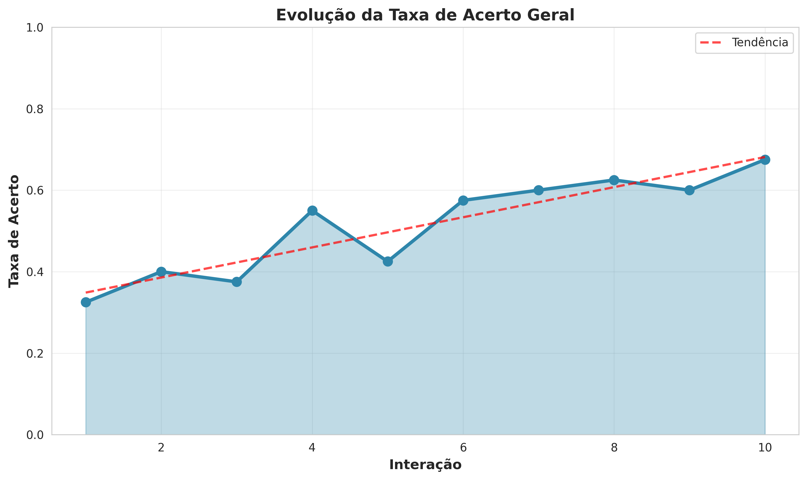
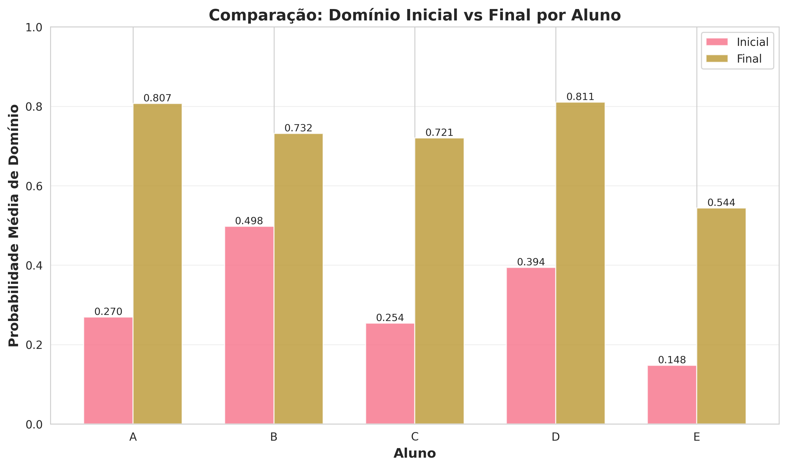
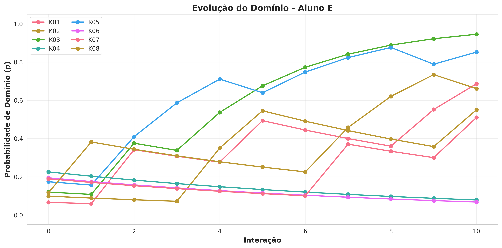
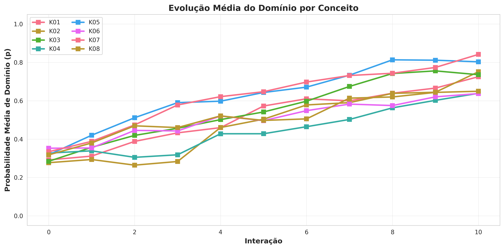
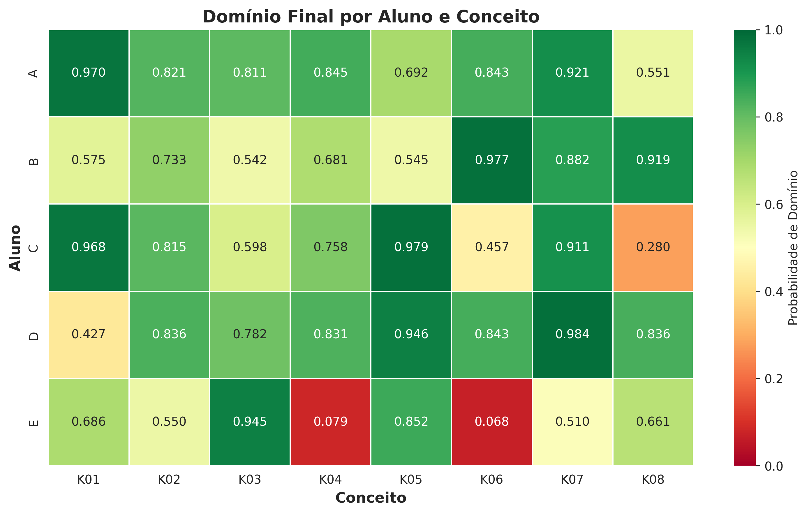

# Análise Interpretativa da Simulação SINKT

**Data da Análise:** 16 de novembro de 2025

## 1. Introdução

Esta análise detalha os resultados da simulação do modelo de rastreamento de conhecimento (baseado em BKT, conforme solicitado), que modelou a evolução do domínio de 5 alunos (A–E) sobre 8 conceitos (K01–K08) ao longo de 10 interações. A simulação utilizou uma taxa de aprendizado (α) de 0.3 e uma taxa de esquecimento/erro (β) de 0.1. O objetivo é interpretar os padrões de aprendizado, identificar desempenhos individuais e avaliar a dificuldade relativa dos conceitos.

Os dados brutos e os cálculos detalhados estão disponíveis na planilha `Simulacao_SINKT_Alunos_Conceitos.xlsx`.

## 2. Análise Geral do Desempenho

A simulação revela uma tendência geral de aprendizado positiva em todo o grupo. A probabilidade média de domínio, considerando todos os alunos e conceitos, evoluiu de **0.313** no início para **0.723** ao final das 10 interações. A taxa de acerto geral foi de **51.5%**, indicando que a simulação apresentou um nível de desafio considerável, com uma mistura de acertos e erros que permitiu a aplicação efetiva das fórmulas de atualização de probabilidade.

*Gráfico 1: A linha de tendência ascendente confirma que, à medida que as interações progridem, os alunos, em média, acertam mais, refletindo o aumento do domínio.* 

## 3. Análise Individual dos Alunos

O desempenho dos alunos variou significativamente, refletindo seus perfis de conhecimento inicial e suas trajetórias de aprendizado.

*Gráfico 2: Comparação da probabilidade média de domínio inicial e final para cada aluno.*

| Aluno | P Inicial (Médio) | P Final (Médio) | Ganho de Domínio | Análise Qualitativa |
| :--- | :--- | :--- | :--- | :--- |
| **A** | 0.270 | 0.807 | **+0.537** | **Aprendizado mais rápido.** Partindo de um nível baixo, o Aluno A demonstrou o maior ganho de domínio, terminando com a segunda maior proficiência média. |
| **B** | 0.498 | 0.732 | +0.234 | **Conhecimento prévio consolidado.** Começou com o maior domínio inicial e, embora seu ganho tenha sido menor, manteve um desempenho sólido e consistente. |
| **C** | 0.254 | 0.721 | +0.467 | **Grande progresso.** Similar ao Aluno A, partiu de um nível baixo e alcançou um domínio final expressivo, mostrando alta capacidade de aprendizado. |
| **D** | 0.394 | 0.811 | +0.417 | **Melhor desempenho final.** Embora não tenha tido o maior ganho, o Aluno D terminou com a maior probabilidade média de domínio, indicando uma excelente assimilação dos conceitos. |
| **E** | 0.148 | 0.544 | +0.396 | **Dificuldades persistentes.** Começou com o menor domínio e, apesar de um ganho notável, terminou com a menor proficiência. Apresentou regressões significativas em alguns conceitos. |

### Destaques Individuais:

- **Aprendizado Rápido:** Os alunos **A** e **C** foram os que aprenderam mais rápido, com os maiores ganhos de domínio.
- **Regressão:** O **Aluno E** exemplifica a regressão. No conceito **K04** e **K06**, sua probabilidade de domínio terminou em valores muito baixos (0.079 e 0.068, respectivamente), indicando que os erros consecutivos nessas áreas impactaram negativamente seu conhecimento estimado. Isso é visível em seu gráfico de evolução individual, onde as linhas para esses conceitos caem drasticamente.

*Gráfico 3: Trajetória de aprendizado do Aluno E, destacando as quedas acentuadas nos conceitos K04 (azul escuro) e K06 (vermelho).* 

## 4. Análise por Conceito

A análise por conceito permite identificar quais foram mais facilmente dominados e quais apresentaram maior dificuldade para o grupo.

*Gráfico 4: Evolução da probabilidade média de domínio para cada um dos 8 conceitos.*

### Nível de Domínio Final por Conceito:

- **Conceitos Dominados:** Os conceitos **K01, K02, K03, e K07** foram os mais bem assimilados pelo grupo, com as maiores médias de domínio final. O conceito **K05** também mostrou uma forte trajetória de aprendizado, terminando com uma das maiores médias.
- **Conceitos Desafiadores:** Os conceitos **K04** e **K08** se mostraram os mais difíceis, com as menores taxas de crescimento e os menores domínios finais médios. O **K06** também apresentou dificuldades, especialmente para alunos como C e E.

O heatmap de domínio final ilustra claramente essa distribuição:

*Gráfico 5: Matriz de probabilidade de domínio final. Verde escuro indica alto domínio (>0.9), enquanto vermelho/laranja indica baixo domínio (<0.4).*

- **Observações do Heatmap:**
  - O **Aluno D** alcançou um domínio excelente (>0.83) em quase todos os conceitos, exceto K01.
  - O **Aluno E** mostra um padrão de domínio irregular, com proficiência alta em K03 e K05, mas muito baixa em K04 e K06.
  - O conceito **K08** foi um desafio para quase todos, com exceção do Aluno D e B.

## 5. Conclusão

A simulação baseada no modelo BKT forneceu insights valiosos sobre o comportamento probabilístico do aprendizado. Foi possível identificar com clareza as diferentes velocidades de aprendizado dos alunos, os efeitos da regressão (esquecimento) devido a erros e a dificuldade intrínseca de cada conceito.

Os resultados validam a capacidade do modelo de rastrear a evolução do conhecimento de forma dinâmica e individualizada, tornando-o uma ferramenta poderosa para sistemas de tutoria inteligente que buscam oferecer feedback e recomendações personalizadas.
